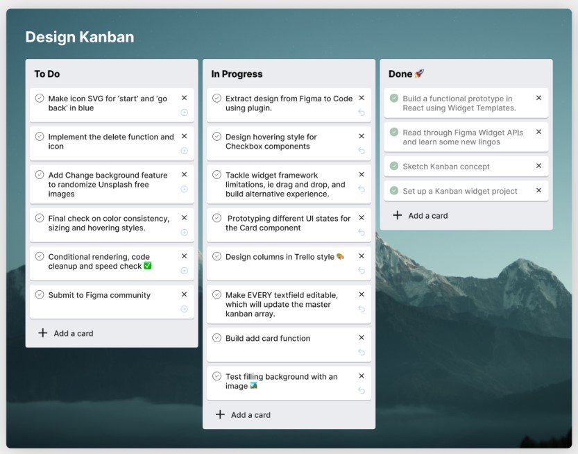

# Kanban Board

Resources: https://www.figma.com/community/widget/1149872275457395522

## Description
You need to create a simple Kanban page to keep track of your tickets and todo items. The page is pretty simple and well known - you need to have 3 columns (To Do, In Progress, Done), you need to have couple of items inside the columns and the ability to easily move items between columns **via drag-n-drop** (required). 

To make the task even a little bit more interesting you need to use [FakerJS](https://fakerjs.dev/) to create dummy data for your items. Also this dummy-data-generation should be automated, so think about that to (no static JSON or JS object will be accepted).

Although the task is 

## Acceptance Criteria
- Create a new React app
- Create 3 columns ()
- Move items between boards via drag-n-drop
- Use FakerJS for dummy data
- Automate the generation of dummy data
- The state of dummy data should NOT be saved, e.g. after a reload is NOT exptected to see the same state as before

## Workflow
- Create a personal project in github and commit your progress there
- When the task is ready create a PR for your mentor to review and discuss the code