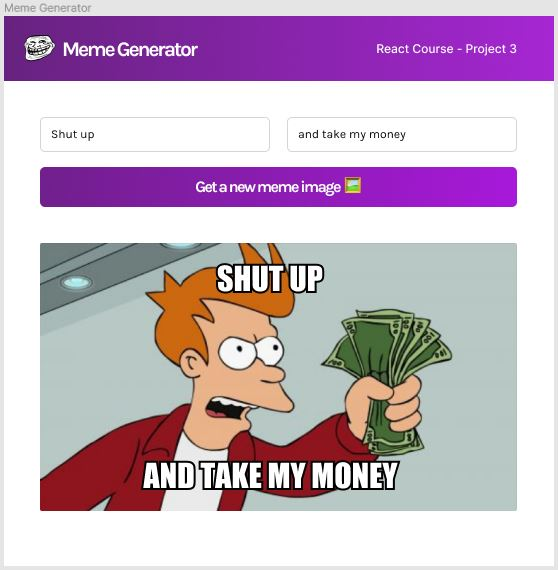

# Meme generator

Resources: https://www.figma.com/file/MoLwFPHNHJVrzdFurxHzNV/Meme-Generator?node-id=0%3A1

## Description
You need to create a small dynamic app like in the provided design from figma.  You need to be able to load a random meme image from an API and via 2 inputs display 2 lines of text in the top and bottom part of the image. You should be able to reload the image and start again.

You can use [Meme API](https://github.com/D3vd/Meme_Api) or go and research another option you like more.

The design should not be completely the same, but keep in mind it should be pretty and easy to use.

## Acceptance Criteria
- Load a meme image from an API
- Have an input elements for entering text
- Displaying the entered data from the inputs on top of the image
- Have a button that reloads the image and clears the inputs

## Workflow
- Create a personal project in github and commit your progress there
- When the task is ready create a PR for your mentor to review and discuss the code