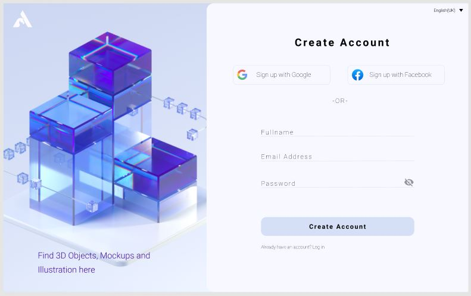

# Register page 

Resource: Register by [Loan Đặng Thị](https://www.figma.com/@loandangthi) - https://www.figma.com/community/file/1135157160105715376

## Description
Create a page where our user has to enter some basic information in order to register himself. The page design is pinned above. The social buttons should be "placeholders" - create the elements like in the design, but leave them without any specific functionality (later we'll be working with social login).

The login form should be containing 3 fields for fullname, email and password. The password shuld be hidden by default, but we can unhide it with the icon button on the right. The button for creating an account should trigger a successfull message via a modal - this is up to you how to be implemented. After we submit the data we would expect to see the user's fields logged in the console.

At this point don't bother with validations. If you wish you can research and try them, but they're not part of the task.

## Acceptance Criteria
- Create a page like in the design
- Have 3 fields for fullname, email, password
- The password field should be able to hide & unhide the value
- The submit button logs the user data in the browser's console
- The submit button triggers a success modal
- After submitting the data we clean and reset the fields